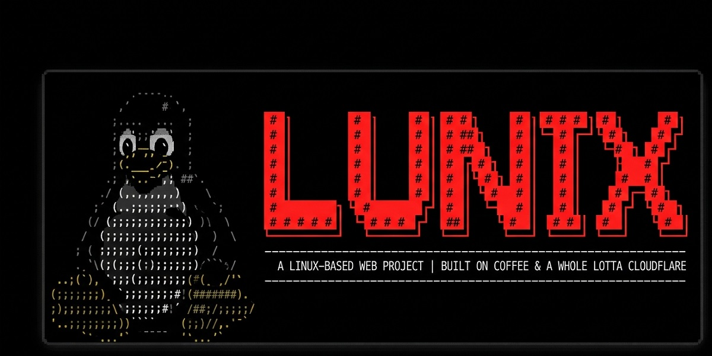

# LUNIX



a linux-flavored terminal, living entirely in your browser. everything you install dies when the tab closes. no cookies, no disk, no judgement. clone it, point it at your own bucket and domain — it's one html file plus a native rust core compiled to webassembly and an optional worker, so companies can run their own instance behind their own name.

**live at:** https://lunix.blueberryservices.co.za

---

## table of contents

1. [what it is](#what-it-is)
2. [architecture](#architecture)
3. [the native core — rust → wasm](#the-native-core--rust--wasm)
4. [the terminal](#the-terminal)
5. [planned commands — being built into the platform](#planned-commands--being-built-into-the-platform)
6. [storage — the r2 bucket](#storage--the-r2-bucket)
7. [session lifecycle & the purge](#session-lifecycle--the-purge)
8. [project layout](#project-layout)
9. [run it from scratch — your bucket, your domain](#run-it-from-scratch--your-bucket-your-domain)
   - [local — zero setup](#local--zero-setup)
   - [github pages — static hosting](#github-pages--static-hosting)
   - [cloudflare worker + r2 + your domain — the full install](#cloudflare-worker--r2--your-domain--the-full-install)
10. [building & testing](#building--testing)
11. [the worker api](#the-worker-api)
12. [customizing](#customizing)
13. [why simulated, not a real vm](#why-simulated-not-a-real-vm)
14. [license & credits](#license--credits)

---

## what it is

LUNIX is a fully self-contained, dependency-free browser terminal that simulates a CLI linux install 1:1, with a native rust core loaded as webassembly at boot:

- systemd-style boot sequence (figlet banner, `[    0.000000] [  OK  ]` log lines)
- `lunix login:` → `Last login:` → `/etc/motd` → bash prompt (no password — just a username)
- prompt is a real install's prompt: `user@lunix:~/path$` (green user, blue path, `#` as root)
- the terminal looks the part: a terminal **window** (title bar showing `user@lunix: ~/path`, minimize / maximize / close buttons) sitting on a desktop, an authentic green-segmented **tmux status bar** with live clock, thin dark scrollbar, selectable copyable output, and a blinking **block cursor** (hollow when unfocused)
- readline editing: `Tab` completes commands *and* paths (bash-style listing on ambiguity), `↑/↓` walk the history, `Ctrl-R` reverse-i-search, `Ctrl-A/E/U/K/W`, `Ctrl-L` clear, `Ctrl-C` cancel line (`^C`; select output + Ctrl-C still copies), `Ctrl-D` EOF logout
- **multiple shells, tmux-style**: windows live in the bottom status bar (`[lunix] 0:bash* 1:bash- +`) — click a segment or press `+` for a new shell; each window owns its own cwd, user, history, draft line and scrollback; `exit` closes one window (the last one logs out); up to 10 windows; sessions survive a refresh
- **tasks stay in their lane**: long-running output belongs to the window that started it — `ping` in window 0 keeps ticking into window 0 even while you work in window 1, and its tab gets a tmux-style `!` activity flag until you check it
- tmux prefix keys, like the real thing: `Ctrl-B` then `c` new window · `n` / `p` next / previous · `0-9` jump to window · `&` kill current (the bar flashes orange while the prefix is armed)
- a working virtual filesystem (`ls` column-major like real ls, `ls -l` with perms/link-count/date columns, `cd`, `cat`, `mkdir -p`, `touch`, `rm`, `mv`, `cp`, `tree`) and a real in-terminal editor: `nano` opens a full-screen buffer with ^O write out, ^X exit (save prompt on modified buffers), ^K/^U line cut & paste
- a simulated `apk` package manager with a 22-package index
- installed tools light up: `cowsay`, `python3`, `git`, `node`, `htop`, `lolcat`, `docker`, `ssh`, `tmux`, `nginx`...
- `ping` with real DNS resolution (DoH) and authentic RTT statistics, `curl`, `wget`, `sudo`, `su`, `history`, `&&` chaining, arrow-up history
- real checksumming: `cksum` is computed by the rust/wasm native core and is byte-for-byte compatible with GNU coreutils output (`crc size file`)
- `>` / `>>` redirection, `reboot`, `poweroff`, `end`, `logout`, `exit`
- device-first sessions: `exps` downloads the whole session to your machine, `imps` imports it back from a file picker — nothing is stored. `exps lock` seals the archive behind a password (pbkdf2 + aes-gcm), so even the file on your desktop is closed until you say otherwise
- device-first audio: `music` plays from the bucket or any url, `music imps` streams audio straight off your device — nothing is uploaded
- device-first video: `vid` opens a file picker and plays video straight off your device in a floating player; `vid <name.mp4>` streams from the bucket, `vid <url>` plays a link, `vid stop` closes it (mp4, webm, ogv, m4v, mov, mkv)
- mobile support: on-screen keys, no iOS zoom, touch-safe layout

the aesthetic is the ZTNA portfolio's dark bash theme: `#000` background, `#c9c9c9` text, Ubuntu green `#4e9a06`, blue `#729fcf`, orange accent `#e95420`, Consolas / Cascadia Mono / Ubuntu Mono.

## architecture

```
┌─────────────────────────────┐
│  browser                    │
│  index.html  ← the terminal │
│  + assets/lunix_core.wasm   │
│    (rust: checksums/hashing)│
│  sessionStorage = the disk  │
└──────────┬──────────────────┘
           │ static files + /api/bucket
┌──────────▼──────────────────┐
│  cloudflare worker (lunix)  │
│  - serves index.html/assets │
│  - /api/bucket* → R2        │
└──────────┬──────────────────┘
┌──────────▼──────────────────┐
│  R2 bucket "lunix" (~10GB)  │
│  - static assets            │
│  - user/ = downloadable     │
│    files (the storage)      │
└─────────────────────────────┘
```

- the app itself needs **no server** — open `index.html` and it runs.
- the wasm core is **optional by design**: if `assets/lunix_core.wasm` can't load (offline copy, missing asset), every other feature works untouched and core-backed commands print an honest notice instead of breaking.
- the worker + R2 add: hosting, the storage API, and the custom domain.

## the native core — rust → wasm

`rust/lunix-core` is a zero-dependency `no_std` rust crate compiled to `wasm32-unknown-unknown` (~650 bytes) and loaded by the terminal at boot. no wasm-bindgen, no glue runtime — a flat C ABI over linear memory:

| export | purpose |
|---|---|
| `lunix_abi()` | ABI version handshake (`1`) |
| `lunix_version_ptr/len()` | version string for `uname`-style reporting |
| `lunix_mem_alloc(len)` / `lunix_mem_reset()` | bump-arena over a static 64 KiB buffer |
| `lunix_cksum(ptr, len)` | POSIX cksum (poly `0x04C11DB7`, MSB-first, length folded LE) — **byte-for-byte identical to GNU coreutils** |
| `lunix_fnv1a64(ptr, len)` | FNV-1a 64-bit hashing (cache keys, dedup) |

the terminal drives it in [`cksum`](#the-terminal): allocate arena → copy file bytes in → call → read the u32 back. correctness is locked by `tests/core.test.js`, which diffs the module against the real GNU `cksum` binary.

why this matters beyond one command: it's the beachhead for the native layer. the roadmap adds rayon-style threading behind COOP/COEP headers (already emitted by the worker), WebGPU compute via `wgpu`, and hot-path moves of the fs layer — same crate, same ABI pattern, no framework lock-in.

## the terminal

| area | commands |
|---|---|
| files | `ls [-l]`, `cd`, `pwd`, `cat`, `echo`, `mkdir [-p]`, `touch`, `rm [-rf]`, `mv`, `cp`, `tree` |
| system | `whoami`, `id`, `uname [-a -r -m]`, `hostname`, `uptime`, `date`, `free`, `cksum <file...>` (rust/wasm, GNU-compatible), `history`, `clear` |
| packages | `apk update`, `apk add <pkg...>`, `apk del <pkg>`, `apk search <term>`, `apk info <pkg>` |
| network | `ping [-c -i -s -t -W -q] <host>` (real DNS via DoH), `curl <url>`, `wget` |
| auth | `sudo`, `su root`, `login` |
| lifecycle | `logout`, `exit`, `reboot`, `poweroff`, `end` |
| storage | `save down [<name>]`, `save up <file>`, `save rm <name>`, `save du` |
| tools | `download <link|name>`, `download list`, `download rm <name>` · `gitshop` — browse every installable item on the branches outside main |
| media | `music <song>` — play audio from the bucket or a url · `music imps` — pick audio off your device and play it · `music stop` — stop (mp3, wav, ogg, m4a, aac, flac, opus, webm) |
| sessions | `exps [lock]` — download the whole session + your bucket media as one `lunix-session.zip` (`lock` seals it behind a password) · `imps` — pick a `.slux` or `.zip` from your device to restore it |
| tools (after `apk add`) | `cowsay`, `python3`, `git`, `node`, `htop`, `lolcat`, `docker`, `ssh`, `tmux`, `fish`, `zsh`, `bash`, `nginx`, `jq`, `neovim`, `vim`, `ripgrep`, `tree`, `openssh` |

quick start:

```
lunix login: lunix
lunix@lunix:~$ apk add cowsay && cowsay moo
lunix@lunix:~$ apk add lolcat && lolcat hi
lunix@lunix:~$ mkdir -p projects/web && cd projects && pwd
lunix@lunix:~$ ping -c 4 github.com     # real DNS, real-looking rtt stats
lunix@lunix:~$ echo hello > h.txt && cksum h.txt   # rust core, GNU-compatible crc
lunix@lunix:~$ exps                      # downloads lunix-session.zip to your device
lunix@lunix:~$ poweroff      # purges everything
```

(no password — just type a username, or press enter for `lunix`)

## planned commands — being built into the platform

status: `done` · `next` (being worked on now) · `planned`

### storage — the r2 bucket (done)

the sim talks to the bucket through the worker api — see [storage](#storage--the-r2-bucket).

| command | what it does | status |
|---|---|---|
| `save down` | list files in the bucket | done |
| `save down <name>` | download a bucket file into the virtual filesystem | done |
| `save up <file>` | upload a virtual file to the bucket | done |
| `save rm <name>` | delete a file from the bucket | done |
| `save du` | show bucket usage | done |
| `man save` | manual page for the save commands | planned |

### sessions — export & import (done)

the whole session is a single `.slux` file — and `exps` wraps it (plus everything in the bucket) into one **`lunix-session.zip`** that downloads to your device: the virtual filesystem (files, directories, installed tools in `/usr/bin`, apk packages, cwd, user, history) as `session.slux`, and your bucket media (mp3/wav/ogg/m4a/aac/flac/opus/webm) under `media/`. the zip's `session.slux` carries a manifest of the bundled media, so imports know exactly what's inside. after a successful download the bundled **audio files are cleared from the bucket** — the archive on your device is the only copy, until `imps` puts them back. nothing is written to the sim or github.

```
lunix@lunix:~$ exps                    # downloads lunix-session.zip (session + your songs)
lunix@lunix:~$ exps lock               # sealed archive — prompts for the password (hidden, twice)
lunix@lunix:~$ exps lock hunter2       # sealed archive — password taken from the command line
lunix@lunix:~$ imps                    # file picker → select the zip → session + media restored
```

| command | what it does | status |
|---|---|---|
| `exps [file]` | download the current session + bucket media as a `.zip` (default `lunix-session.zip`) — device-only; bundled audio is then cleared from the bucket | done |
| `exps lock [file]` | same export, sealed behind a password — typed twice with hidden input | done |
| `exps lock <password> [file]` | one-shot locked export: the password comes straight from the command line (note: it lands in your session history) | done |
| `imps` | open a file picker and import a `.slux`/`.zip` — restores files, pkgs, tools, cwd, history, and re-uploads media. locked archives ask for the password first | done |
| `imps <file>` | import a `session.slux` from the virtual filesystem | done |
| `imps <url>` | import from a direct/raw link (.slux or .zip) | done |

the zip is built in the browser (store-method zip, no dependencies) — comfortably handles a normal session plus hundreds of songs; multi-gig archives are beyond browser memory, so giant media keeps the straight-to-device download path instead.

#### the lock

`exps lock` is for when the archive outlives the tab: a zip on your desktop, in a sync folder, on a usb stick. unlocked exports are plain files anyone can read; locked exports are sealed.

- **crypto:** pbkdf2-hmac-sha256 (200,000 iterations) derives a 256-bit aes-gcm key from the password; every entry gets a fresh random 96-bit iv and its own authentication tag
- **format:** each zip entry is renamed `<name>.locked` and its bytes replaced by an envelope — `SLXLOCK1` magic · version · 16-byte salt · iv · ciphertext. it's still a normal zip; every byte inside it is just sealed
- **import:** `imps` detects the envelope, prompts for the password (input hidden), and decrypts in place. a wrong password fails gcm authentication — no partial restore, no hint about the content
- **zero dependencies:** all of it is the browser's native WebCrypto — nothing is sent anywhere, the password never leaves the tab, and it never touches sessionStorage or history
- **needs a secure context** (https, or opening `index.html` locally as `file://`) — plain http has no WebCrypto and the sim tells you so

### music

`music <song>` plays audio files straight from the bucket (or any url) through a hidden `<audio>` element — only audio extensions are accepted, `music stop` silences it. `music imps` opens a file picker: pick any audio file from your device and it streams straight off disk via an object url — nothing is uploaded, nothing is stored, the purge never even notices.

```
lunix@lunix:~$ music song.mp3          # plays from the bucket
lunix@lunix:~$ music stop
lunix@lunix:~$ music https://example.com/radio.ogg
lunix@lunix:~$ music imps              # file picker → play audio from your device
```

| command | what it does | status |
|---|---|---|
| `music <song>` | play an audio file from the bucket (`save up` it first) or any direct url | done |
| `music imps` | open the device file picker and stream the picked audio straight off disk via an object url — device-only, nothing is uploaded or stored | done |
| `music stop` | stop playback and release the audio (object urls are revoked too) | done |

accepted formats: **mp3, wav, ogg, oga, m4a, aac, flac, opus, webm** — the extension is the gate; actual decoding is up to the browser's `<audio>` element. playback errors tell you which case you hit: not-an-audio-file, missing-from-bucket, or a format your browser can't decode.

notes:
- `music imps` works fully offline — no bucket, no network, no session token
- picking a new file with `music imps` replaces what's playing and revokes the previous object url
- big files are fine here: unlike the virtual filesystem (~5–10 MB sessionStorage cap), device playback streams from disk, so multi-hundred-MB flacs just work

### network & security

| command | what it does | status |
|---|---|---|
| `ping [-c -i -s -t -W -q] <host>` | real ping: resolves hostnames via DoH (dns.google), progressive replies, ttl, ~3% loss, `rtt min/avg/max/mdev` — sim hosts (`lunix`, `localhost`) are instant | done |
| `nmap [-sV] [-sn] [-p <ports>] <host>` | scan the sim's internet — the sim answers: host up, the usual ports open (install via `download nmap`) | done |
| `dig <name> [<type>]` | real dns lookups via 1.1.1.1 (DoH), like the portfolio terminal | planned |
| `iptables -L` | show the gate as firewall rules (the mTLS zero-trust story) | planned |
| `connect` | show this session's identity and badge state | planned |
| `ip addr` / `hostname -I` | the sim's network card: 192.168.86.100/24, latency 0ms | planned |

### system

| command | what it does | status |
|---|---|---|
| `man <cmd>` | mini manual pages for every command | planned |
| `top` | process list — one process: `pretending` | planned |
| `env` / `echo $PS1` | real-looking environment output | planned |
| `df` / `du` | disk usage of the virtual filesystem (sessionStorage-backed) | planned |
| `stat` / `file` / `head` / `tail` / `grep` | the coreutils the fs deserves | planned |
| `apt` | easter egg: "this is alpine. it's apk. don't." | planned |

### fun

| command | what it does | status |
|---|---|---|
| `matrix` | the rain, but in the browser | planned |
| `snake` | playable snake in the terminal | planned |
| `sl` | an angry steam locomotive when you misspell `ls` | planned |
| `fortune` | one-liners from the void | planned |
| `figlet <text>` | the banner font, on demand | planned |
| `weather` / `clock` | live weather (wttr.in) and clock | planned |
| `coffee` / `42` / `godmode` / `hack` | the classics | planned |

### terminal features

| feature | what it does | status |
|---|---|---|
| tab completion | completes command names and file paths (`Tab`; bash-style candidate listing on ambiguity) | done |
| `history` search | ctrl-r style reverse search (enter accepts, esc restores the line) | done |
| readline editing | `↑/↓` history walking with draft restore, `Ctrl-A/E` home/end, `Ctrl-U/K/W` kill line/word, `Ctrl-L` clear, `Ctrl-C` cancel, `Ctrl-D` logout | done |
| terminal window chrome | desktop backdrop, title bar (`user@lunix: ~/path` follows cwd/user), minimize → dock pill / maximize / close (= poweroff, confirms first) | done |
| multiple shells (tmux windows) | status-bar window list + `+`; per-shell cwd/user/history/scrollback; `Ctrl-B c/n/p/0-9/&` prefix chords; `exit` closes a window; cap 10; survives refresh | done |
| per-window task output | async output (ping, fetches, tools) routes back to the window that spawned it, even after switching; background windows show an activity flag | done |
| block cursor | blinking block caret like gnome-terminal; hollow when unfocused; hidden while typing passwords | done |
| tmux status bar | green `[lunix] 0:bash*` segment + uptime / pkgs / session id / live clock cells | done |

want a command added? it's a few lines in the `CMDS` map — see [customizing](#customizing).

## storage — the r2 bucket

the 10GB R2 bucket is the sim's external storage. files uploaded under the `user/` prefix are downloadable through the worker api — and survive the purge. the `save` family in the terminal drives it all:

```
lunix@lunix:~$ echo "this survives the tab" > notes.txt
lunix@lunix:~$ save up notes.txt
lunix@lunix:~$ save down           # list
lunix@lunix:~$ save down notes.txt # write into the virtual fs
lunix@lunix:~$ save du             # usage
lunix@lunix:~$ save rm notes.txt
```

the worker exposes (all behind the `lunix` worker; the bucket API is hardened):

| endpoint | purpose | access |
|---|---|---|
| `GET /api/bucket` | list downloadable files: `{"files":[{"name","size","modified"}]}` | requires `X-Lunix-Session` token + trusted origin |
| `GET /api/bucket/<name>` | download file bytes (`Content-Disposition: attachment`) | trusted origin (token not required so saved links work) |
| `PUT /api/bucket/<name>` | upload file bytes (body = file content) | requires token + trusted origin; max 2.5 GiB |
| `DELETE /api/bucket/<name>` | delete the file | requires token + trusted origin |

hardening:
- **origin allowlist** — requests with an `Origin` header are only accepted from origins in `ALLOWED_ORIGINS` (`worker/index.js`; this deployment allows `https://lunix.blueberryservices.co.za`, plus `null` for local `file://` dev). self-hosting? put your own domain there. other websites can't read, write, or delete your bucket files, even with a valid token
- **per-session token** — the shell sends its session id (`X-Lunix-Session`) on list/upload/delete; unknown or malformed tokens get `401`
- **method lock** — only `GET`/`PUT`/`DELETE`/`OPTIONS`; anything else is `405`
- **size cap** — uploads over 2.5 GiB are rejected (`413`)
- **security headers** on every response: `X-Frame-Options: DENY`, `nosniff`, COOP/COEP, no-referrer
- path traversal (`/`, `..`) in file names is rejected with `400`

### wids — sensor ingest (pocketwids pipeline)

telemetry from the M5Stick PocketWIDS wireless IDS sensor lands in R2 as jsonl and is read by the `wids` tool inside the sim:

| endpoint | purpose | access |
|---|---|---|
| `POST /api/wids` | append one sensor event (json body) | requires `X-Wids-Key` header matching the `WIDS_KEY` worker secret |
| `GET /api/wids?limit=N&type=T` | read recent events, newest first | trusted origin (same-origin from the sim) |

- events are capped at 1000 (oldest trimmed); each is `{type, detail, channel, rssi, sensor, ts}`
- deploy the secret once: `npx wrangler secret put WIDS_KEY`
- install the reader tool in the sim: `download wids`, then `wids log` / `wids status`

large files:
- the virtual filesystem lives in `sessionStorage` (~5–10 MB per origin), so anything over 2 MiB can't live *inside* the sim
- `save down` detects that: files over 2 MiB are downloaded **straight to your device** (native browser download) instead of into the virtual memory; if a small file still doesn't fit, it falls back to the same device download
- note: the cloudflare **free** workers plan caps request bodies (~100 MB; ~500 MB paid), so an upload that big through the worker needs a paid plan or a direct R2 (S3) upload — the API-side cap is 2.5 GiB either way

notes:
- names are flat (no `/`), path traversal is rejected with 400
- static assets (iso, bios, wasm) live outside `user/` so they never show in the list
- the bucket is currently public-read through the worker for downloads — the read path is origin-gated; gate it fully behind the mTLS badge if you want it locked like `save://`

## tools & the .slux format

tools are tiny programs you download into the virtual memory. they are hosted in the **`tools` branch** of this repo, one `.slux` file per tool, and installed with:

```
lunix@lunix:~$ download list                          # what's on the tools branch
lunix@lunix:~$ gitshop                                # browse all non-main branches of the repo
lunix@lunix:~$ download nmap                          # installs from the tools branch
lunix@lunix:~$ download https://github.com/OMEGALULUL/LunixOS/blob/tools/nmap.slux
lunix@lunix:~$ nmap -sV 192.168.86.100                # the tool now works
lunix@lunix:~$ download rm nmap                       # uninstall
```

- `download <name>` defaults to `raw.githubusercontent.com/OMEGALULUL/LunixOS/tools/<name>.slux`
- any github blob/raw link works; the tool is parsed, its bash section runs in the sim, and its code registers the command
- **safety:** anything outside the official tools branch triggers a warning and a confirmation dialog — a `.slux` is executable code that can read your files, history, and storage bucket, so only install from sources you trust
- the `.slux` file is stored at `/usr/bin/<name>.slux` — it survives a refresh (sessionStorage) and is re-loaded at boot. the purge still wipes it. re-downloading recreates everything.
- the tools branch also carries a `TOOLS.md` describing the format and how to add your own tool

### the .slux format

```slux
#slux name nmap
#slux desc "scan the simulated internet"
#slux version 1.0.0

# bash section — ordinary LUNIX bash, executed on install
mkdir -p /usr/bin
echo "a note" > /usr/bin/nmap.README.txt

#slux code
register("nmap", function (args) {
  print("Nmap scan report for " + (args[0] || "you"));
});
```

meta header: `#slux name|desc|version`. the bash section can use any sim command (including `>` redirection and `mkdir -p`) to create files, install apk deps, etc. the code section has access to the sim's globals (`print`, `err`, `printHtml`, `fs`, `pkgs`, `esc`, `CMDS`...) and must call `register("<name>", function (args) {...})`.

tools on the branch: a full traditional `nmap` (`-sV`, `-sn`, `-sS`, `-O`, `-A`, port ranges, `-oN/-oG/-oX` output files), the `wids` PocketWIDS console, and `ytc` — a YouTube converter front-end: `ytc <link> [mp3|mp4] [quality]` shows live yt-dlp-style progress in the terminal and saves the finished file **straight to your device** (the sim never stores it). installed tools discover their infrastructure at runtime via the worker's `/api/config` endpoint, so `ytc` automatically rides whatever converter **your** deployment configured (`YTC_UPSTREAM` in `worker/index.js`) — no hardcoded endpoints, no tool edits when you swap converters.

tools also deploy to the R2 bucket under `tools/` so they can be fetched from the LUNIX domain itself.

## session lifecycle & the purge

- the sim's disk is `sessionStorage` (browser memory for this tab)
- **close the tab → everything is gone.** that's the purge, by construction
- refresh keeps your session (nice)
- `poweroff` / `end` → wipes state and reboots
- `reboot` → reboots without wiping
- the tmux bar at the bottom shows uptime, package count, and the session id

## project layout

```
lunix/
├── index.html          ← the terminal. copy this anywhere, it runs.
├── Makefile            ← build / test / deploy
├── package.json        ← dev deps (jsdom for the test suites)
├── assets/
│   └── lunix_core.wasm ← built native core (make build)
├── rust/
│   └── lunix-core/     ← the native core source (no_std, zero deps)
│       ├── Cargo.toml
│       └── src/lib.rs
├── tests/              ← jsdom regression suites + wasm parity tests (120 checks)
├── README.md
├── LICENSE             ← MIT, © 2026 Blueberry Services
├── LUNIX.jpg
├── tools/              ← .slux tool definitions + TOOLS.md (upload these to the `tools` branch)
└── worker/             ← optional cloudflare layer
    ├── index.js        ← worker source (static + /api/bucket + /api/wids + .slux + wisp relay)
    └── wrangler.jsonc  ← worker config (R2 binding "LUNIX")
```

## run it from scratch — your bucket, your domain

LUNIX is fully self-hostable: one `index.html` plus an optional cloudflare worker. nothing phones home to us — companies can clone this repo and run the whole thing (terminal, storage api, tools) on their own cloudflare account, their own r2 bucket, and their own domain.

### what to point at your own stuff

| file | setting | why |
|---|---|---|
| `worker/index.js` | `ALLOWED_ORIGINS` | add your origin (`https://lunix.yourcompany.com`) — only listed origins may call the storage/wids apis |
| `index.html` | `FALLBACK_API` | only used when the sim is opened from `file://`; point it at your worker (or leave `""` for a fully offline local sim) |
| `worker/wrangler.jsonc` | `"name"`, `"bucket_name"` | your worker's name and your r2 bucket |
| `index.html` | `/etc/motd`, `/etc/os-release`, `BOOT_LINES`, theme vars | branding — make it yours |

hosted deployments need **zero code changes** to stop using blueberry infrastructure: served over http/https, every api call is same-origin against your own worker. the tool registry defaults to the upstream github repo (`OMEGALULUL/LunixOS`, tools branch) so `download nmap` works out of the box; it's public static files, not our cloudflare.

### local — zero setup

```sh
open index.html        # that's it. works from any browser
```

runs fully offline except features that need the bucket api (`save`, `music <song>` from a bucket, `exps` media bundling). `music imps`, locked exports, and every filesystem command work with no server at all.

### github pages — static hosting

1. create a repo (e.g. `lunix`) and push `index.html` to the root
2. repo → settings → pages → deploy from branch `main` / root
3. it's live at `https://<you>.github.io/lunix`

this mode has no storage api (pages serve files, they don't run the worker). everything else works; set `FALLBACK_API` in `index.html` to a deployed worker somewhere if you still want `save`/bucket music.

### cloudflare worker + r2 + your domain — the full install

prereqs: a cloudflare account + zone, wrangler authenticated (`npx wrangler login`, or `CLOUDFLARE_API_TOKEN` + `CLOUDFLARE_ACCOUNT_ID` env vars).

```sh
# 0. point the code at your domain first:
#    - worker/index.js  → ALLOWED_ORIGINS: add "https://lunix.yourcompany.com"
#    - index.html       → FALLBACK_API (only matters for file:// usage)

# 1. create your bucket
npx wrangler r2 bucket create lunix

# 2. upload the app (+ optional v86 assets for the real-vm revival)
npx wrangler r2 object put lunix/index.html --file index.html --remote
npx wrangler r2 object put lunix/assets/lunix_core.wasm --file assets/lunix_core.wasm --remote
npx wrangler r2 object put lunix/user/test_download.txt --file test.txt --remote

# 3. deploy the worker
cd worker
npx wrangler deploy
# → https://lunix.<your-subdomain>.workers.dev

# 4. your domain (two calls — replace zone id / hostname / script name)
#    dns:  CNAME lunix.yourcompany.com → lunix.<your-subdomain>.workers.dev  (proxied)
#    zone route:  pattern "lunix.yourcompany.com/*" → script "lunix"

# 5. optional — the wids sensor ingest secret (only if you use PocketWIDS)
npx wrangler secret put WIDS_KEY
```

the worker serves:

| path | content |
|---|---|
| `/` | `index.html` from R2 (no-cache) |
| `/v86.js` `/v86.wasm` `/alpine.iso` `/bios/*` | cached immutable assets (real-vm revival) |
| `/api/bucket` | bucket file list |
| `/api/bucket/<name>` | bucket file download |
| `/api/wids` | PocketWIDS sensor event feed (read) / ingest (write, needs key) |
| `/api/ytc/*` | same-origin relay to the YouTube converter (info / jobs / download streaming) |
| `/api/config` | infrastructure discovery for installed tools (reports the deployment's converter route) |
| `/wisp` | websocket relay (real-vm revival, needs workers paid) |

notes for deployments:
- **data stays yours** — uploads land in *your* r2 bucket, under your account's controls and region policy; the sim itself stores nothing server-side
- **the session token is per-tab** (`X-Lunix-Session`) and only gates list/upload/delete; downloads are origin-gated so saved links keep working
- **air-gapped-ish mode:** serve `index.html` from any static file server (s3, nginx, an intranet share) — users get the full terminal with zero calls to our infrastructure (note: `ping`, `curl`, and url-based `music` still reach the internet by design; on a closed network they just fail like they would on a real box)

## building & testing

prereqs: [rust](https://rustup.rs) with the `wasm32-unknown-unknown` target (`rustup target add wasm32-unknown-unknown`), node ≥ 18, `npm i` once for jsdom.

```sh
make build     # cargo build → assets/lunix_core.wasm (~650 bytes)
make test      # wasm parity vs GNU cksum + 6 jsdom regression suites (120 checks)
make deploy    # build, then upload index.html + wasm to the r2 bucket via wrangler
```

the jsdom suites boot the real app headlessly: full boot sequence, login, and command execution against mocked network. `tests/core.test.js` instantiates the built wasm directly and diffs it against this machine's GNU coreutils — checksum drift can never ship silently.

## the worker api

**list**

```sh
curl -H "X-Lunix-Session: <session-id>" https://lunix.blueberryservices.co.za/api/bucket
# {"files":[{"name":"test_download.txt","size":27,"modified":"2026-08-19T16:15:38.780Z"}]}
```

**download** (no token needed)

```sh
curl -OJ https://lunix.blueberryservices.co.za/api/bucket/test_download.txt
```

**upload**

```sh
curl -X PUT --data-binary @notes.txt \
  -H "X-Lunix-Session: <session-id>" \
  https://lunix.blueberryservices.co.za/api/bucket/notes.txt
```

**delete**

```sh
curl -X DELETE -H "X-Lunix-Session: <session-id>" \
  https://lunix.blueberryservices.co.za/api/bucket/notes.txt
```

## customizing

- **packages**: edit the `PKGS` map in `index.html` (name, size MiB, description)
- **boot log**: edit `BOOT_LINES` (timestamp, message, `ok:` / `fatal:`)
- **motd / os-release**: edit `/etc/motd` and `/etc/os-release` in the `fs` map
- **theme**: edit the `:root` variables at the top of the `<style>` block
- **commands**: add a key to the `CMDS` map

## why simulated, not a real vm

originally LUNIX was planned as a real v86 VM booting Alpine (270MB ISO, staged in the bucket) with a wisp relay worker for real internet (`apk` installs would be real). outbound TCP sockets (`node:net` connect) turned out to be blocked on the free workers plan — the proxy refuses every handshake ("consider using fetch instead"). per the decision rule ("real vm if it works on cloudflare, otherwise simulate"), the sim shipped and the v86 path was parked:

- the relay worker (`/wisp`, wisp protocol over websocket) is still in `worker/index.js`
- the v86 assets (libv86.js, v86.wasm, seabios, vgabios, alpine ISO) are still in the bucket
- if the account ever moves to **workers paid** (enables tcp sockets), the real vm is a frontend swap + redeploy away

---

LUNIX is a demo/portfolio piece — the point is that the purge is always watching.

## license & credits

MIT — see [LICENSE](LICENSE). companies and individuals are free to use, modify, self-host, and ship LUNIX (including commercially); the only ask is keeping the copyright notice. no warranty, no strings.

built by **chris visser** at **blueberry services** — the purge daemon is always watching.